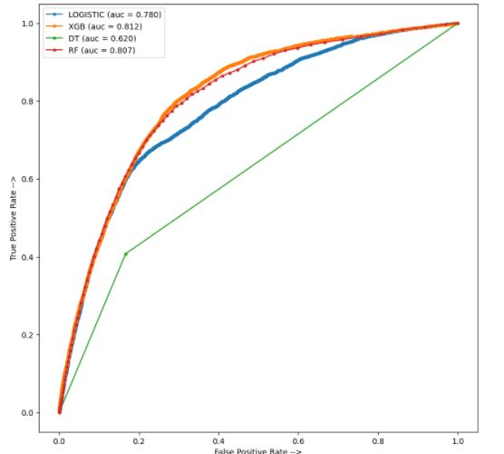
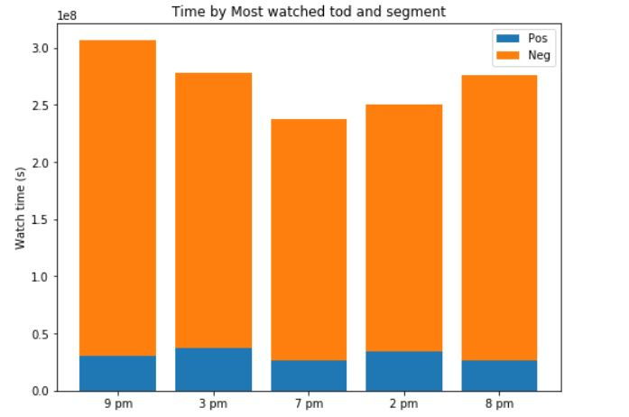

# Varun's Portfolio

## Projects:

### [1. Classification of Hepatitis C Categories](https://github.com/varuntandon04/Hepatitis-C-Data-Analysis)

### This project is to showcase my skills in a classification problem, and how I approach fine tuning models. The primary goal was to perform multi-class classification on the Kaggle [dataset](https://www.kaggle.com/fedesoriano/hepatitis-c-dataset). Multiple models were tested and compared.
#### Models used:
* Decision Tree
* Random Forest
* XGBoost

#### Metrics used:
* Accuracy

#### Some snapshots:
 

---

### [2. Classification of Pokemon using Convolutional Neural Networks](https://github.com/varuntandon04/Pokemon_CNN_Classification)

### This project is to showcase my understanding of how Neural Networks operate and can be created from scratch. My goal was not to achieve near 100% accuracy, but rather see if a model I build is viable for the type of classification I'm performing and the type of [dataset](https://www.kaggle.com/thedagger/pokemon-generation-one) I'm using.
#### Model Used:
* A variation of VGG-16

#### Metrics used:
* Accuracy

#### Some snapshots:

 
---
### [3. Hotstar Predict The Segment](https://github.com/varuntandon04/Hotstar-Predict-The-Segment)

### This project was undertaken by my peers from RIT and I to classify whether a user of the streaming platform "Hotstar" would have a positive or a negitive sentiment towards the platform. The main goal of this project was to deal with data that was heavily imbalanced (2:23).

#### Models used:
* Logistic Regression
* Decision Tree
* Random Forest
* XGBoost

#### Metrics Used:
* AUC ROC 

#### Some snapshots:

 

---

---

## Published Research Paper:

#### [Rice Crop Diseases and Pest Detection Using Edge Detection Techniques and Convolution Neural Network](https://link.springer.com/chapter/10.1007/978-981-16-8225-4_5)

## Certifications:
#### Data Science Math Skills

---  

#### Applied Machine Learning in Python
.jpg)

---

#### Applied Text Mining in Python

---

#### Applied Social Network Analysis in Python

--- 

#### Machine Learning

---  

#### Computer Vision

---  

 

