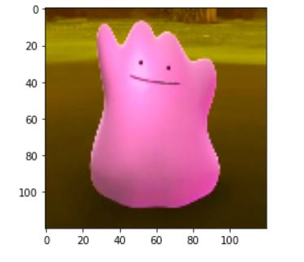
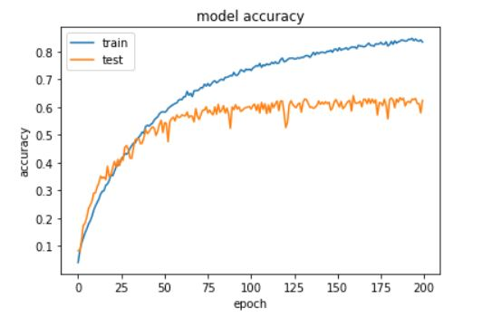

# Varun's Portfolio

## Projects:

### [1. Classification of Hepatitis C Categories](https://github.com/varuntandon04/Hepatitis-C-Data-Analysis)

### This project is to showcase my skills in a classification problem, and how I approach fine tuning models. The primary goal was to perform multi-class classification on the Kaggle [dataset](https://www.kaggle.com/fedesoriano/hepatitis-c-dataset). Multiple models were tested and compared.
#### Models used:
* Decision Tree
* Random Forest
* XGBoost

#### Metrics used:
* Accuracy

#### Some snapshots:
 

---

### [2. Classification of Pokemon using Convolutional Neural Networks](https://github.com/varuntandon04/Pokemon_CNN_Classification)

### This project is to showcase my understanding of how Neural Networks operate and can be created from scratch. My goal was not to achieve near 100% accuracy, but rather see if a model I build is viable for the type of classification I'm performing and the type of [dataset](https://www.kaggle.com/thedagger/pokemon-generation-one) I'm using.
#### Model Used:
* A variation of VGG-16

#### Metrics used:
* Accuracy

#### Some snapshots:
 
 
---
### [1. Sem6_TitanicProject](https://github.com/varuntandon04/Sem6_TitanicProject)

### The primary goal was to learn and showcase:
#### Data Handling:
* Importing Data with Pandas
* Cleaning Data
* Exploring Data through Visualizations with Matplotlib

#### Data Analysis:
* Using supervised machine learning techniques

#### Valuation of the Analysis:
* K-folds cross validation to valuate results locally

 .png) 
---

---

## Certifications:
#### Data Science Math Skills

---  

#### Applied Machine Learning in Python
.jpg)

---

#### Applied Text Mining in Python

---

#### Applied Social Network Analysis in Python

--- 

#### Machine Learning

---  

#### Computer Vision

---  

 

